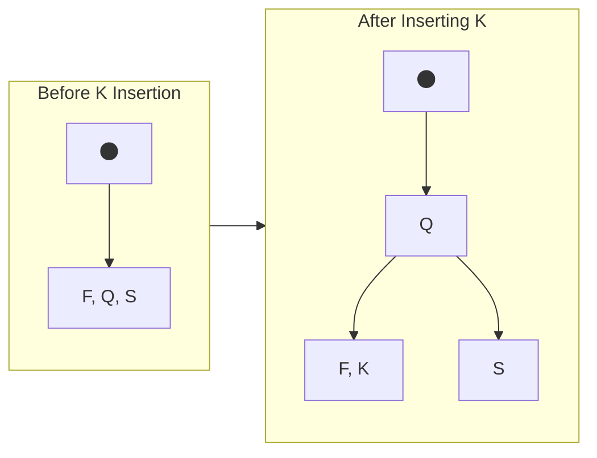
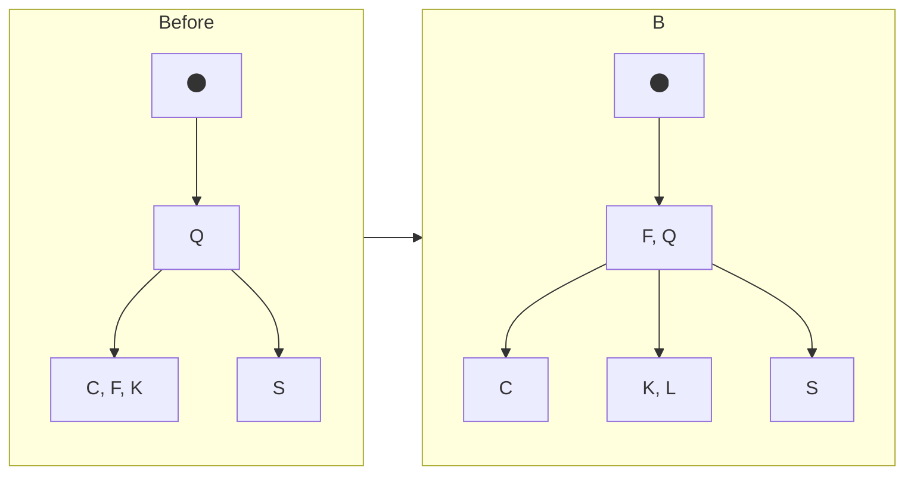
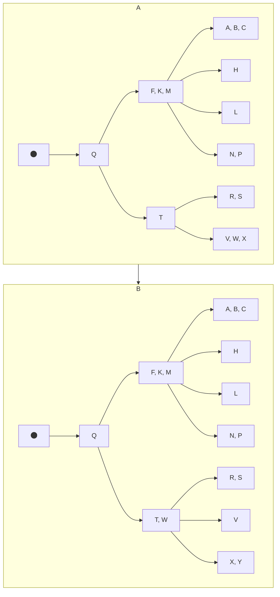
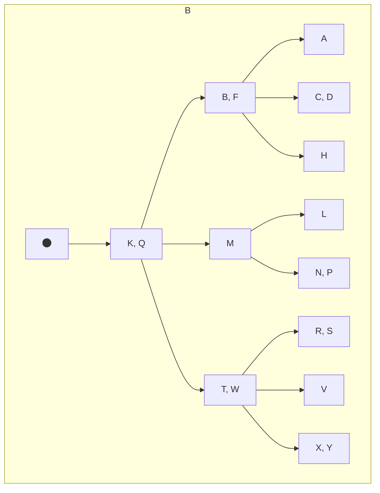
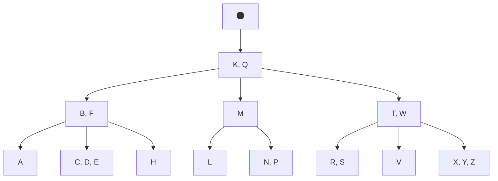

# 18.2 Basic operations on B-trees

## 18.2-1

Show the results of inserting the keys

```text
 F, S, Q, K, C, L, H, T, V, W, M, R, N, P, A, B, X, Y, D, Z, E
```

in order to an empty B-tree with **minimum degree 2**. Draw only the configurations of the tree just before some node must split, and also draw the final configuration.

### Answer

Insertion of `F`, `S` and `Q` will not make any node split.

Insertion of `K`:



Insertion of `C` will not make any node split.

Insertion of `L`:



Insertion of `H`, `T`, `V` will not make any node split.

 W, M, R, N, P, A, B, X, Y, D, Z, E

Insertion of `W` and `M`:

 ```mermaid
flowchart TD
    subgraph A
    root[fa:fa-circle] --> fq[F, Q]
    fq --> C1[C]
    fq --> n[H, K, L]
    fq --> n2[S, T, V]
    end
    subgraph B
    root2[fa:fa-circle] --> fqt[F, Q, T]
    fqt --> C2[C]
    fqt --> hkl[H, K, L]
    fqt --> S
    fqt --> vw[V, W]
    end
    subgraph C
    root3[fa:fa-circle] --> Q
    Q --> fk[F, K]
    Q --> T
    fk --> C3[C]
    fk --> H
    fk --> lm[L, M]
    T --> S2[S]
    T --> vw2[V, W]
    end
    A --> B
    B --> C
 ```

 D, Z, E






